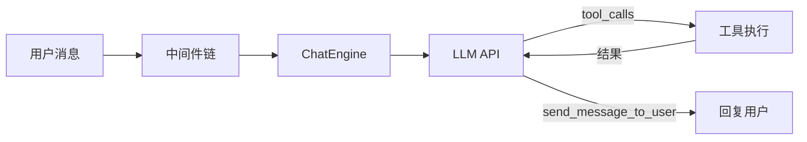
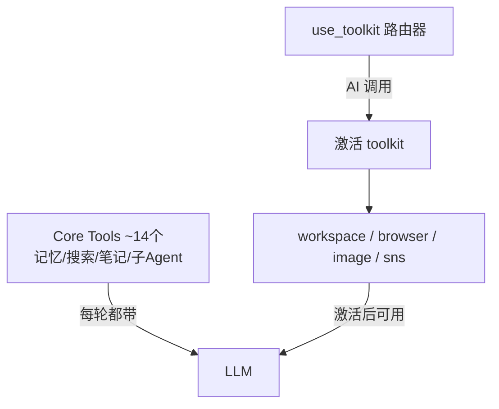
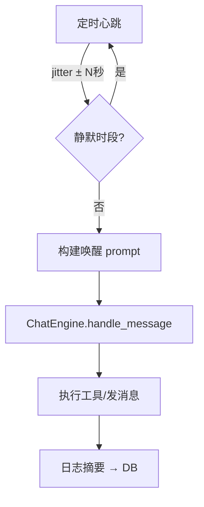

# 🌙 OpenKaguya — 开源版辉夜姬

在个人电脑上运行的、人格化的、拥有主动意识的、能运行各种终端能力的聊天陪伴助手。

> 辉夜姬，一名16岁的、好奇心旺盛的少女，终于又一次来到了地球，只不过这一次，她居然来到了一台电脑中！

## ✨ 特色

- **人格化**：辉夜姬不是工具，而是有自己个性、情绪和记忆的伙伴
- **主动意识**：她会自己醒来、上网冲浪、写笔记、把有趣的发现分享给你
- **多平台**：支持微信、CLI（更多平台可扩展）
- **记忆系统**：话题级向量化长期记忆 + 关键词混合检索
- **按需工具**：Toolkit 路由器，核心工具常驻，浏览器/文件/图像生成等按需激活
- **插件架构**：Adapter（平台）+ Provider（AI 能力）双轨扩展

---

## 📐 架构总览

```
src/kaguya/
├── main.py              # 入口：初始化所有模块并启动
├── config.py            # TOML 配置加载系统
│
├── core/                # 核心引擎
│   ├── engine.py        # ChatEngine — 对话主循环、工具调用、多轮推理
│   ├── consciousness.py # ConsciousnessScheduler — 主动意识（定时唤醒）
│   ├── middleware.py     # 中间件接口
│   ├── group.py         # 群聊过滤中间件
│   ├── identity.py      # 跨平台用户身份管理
│   └── types.py         # UnifiedMessage 等类型定义
│
├── llm/                 # LLM 抽象层
│   ├── client.py        # LLMClient — OpenAI 兼容的 chat/tool-calling
│   └── embedding.py     # EmbeddingClient — 向量化
│
├── memory/              # 记忆系统
│   ├── database.py      # SQLite 持久化（消息、话题、笔记、定时器）
│   ├── middleware.py     # MemoryMiddleware — 自动摘要 + 向量化
│   └── topic_manager.py # 话题管理器（分段、摘要、向量更新）
│
├── tools/               # 工具系统
│   ├── registry.py      # ToolRegistry — 工具注册中心
│   ├── toolkit_router.py# ToolkitRouter — 按需工具组激活
│   ├── builtin.py       # 内置工具（文件、终端、笔记、定时器等）
│   ├── browser.py       # 浏览器工具集（browser-use 封装）
│   ├── web_search.py    # 网络搜索（Exa / Tavily 双后端）
│   ├── memory_tools.py  # 记忆检索工具（语义搜索、关键词检索）
│   ├── sub_agent.py     # 子 Agent 委派工具
│   ├── avatar.py        # 头像管理 + set_avatar 工具
│   └── workspace.py     # WorkspaceManager — 用户/AI 文件空间
│
├── adapters/            # 平台适配器
│   ├── base.py          # PlatformAdapter 接口
│   ├── cli.py           # CLI 适配器（本地交互）
│   ├── wechat.py        # 微信适配器（WebSocket + HTTP API）
│   └── wechat_tools.py  # 微信朋友圈工具
│
└── providers/           # AI 能力提供者
    ├── __init__.py      # BaseProvider 接口
    └── qwen_image.py    # 千问图像（Z-Image 文生图 + Qwen 图像编辑）
```

---

## 🧩 设计模式

### 1. 对话引擎 — 工具调用循环



`ChatEngine._process_message` 实现多轮工具调用循环（最多 15 次迭代），LLM 通过 Function Calling 调用工具，工具结果反馈给 LLM，直到 LLM 决定回复用户。

### 2. Toolkit 路由器 — 按需工具激活



将 30+ 工具分为常驻核心工具和按需激活的工具组，减少每轮 token 消耗 ~3000 tokens。

### 3. 双轨扩展 — Adapter + Provider

| 维度 | Adapter（平台适配器） | Provider（AI 能力提供者） |
|------|----------------------|--------------------------|
| 职责 | 连接聊天平台 | 提供 AI 能力 |
| 示例 | 微信、CLI、Telegram | 图像生成、TTS |
| 接口 | `PlatformAdapter` | `BaseProvider` |
| 注入 | 平台专属工具 + prompt | 能力工具 + 说明 prompt |
| 阶段感知 | `get_tools(phase)` | `get_tools(phase)` |

两者共享相同的三方法接口：`get_tools(phase)` / `get_system_prompt(phase)` / `get_injected_prompt(phase)`

### 4. 主动意识 — ConsciousnessScheduler



辉夜姬以可配置间隔自动唤醒，拥有独立决策能力：浏览网页、写笔记、主动给朋友发消息。

### 5. 中间件链

```
用户消息 → GroupFilterMiddleware → MemoryMiddleware → ChatEngine
```

- **GroupFilterMiddleware**：群聊消息过滤（是否 @机器人）
- **MemoryMiddleware**：自动注入历史上下文 + 触发记忆向量化

### 6. 记忆系统 — 分层记忆

| 层 | 存储 | 用途 |
|----|------|------|
| 临时记忆 | 内存（最近 N 条） | 短期上下文窗口 |
| 话题记忆 | SQLite + 向量 | 自动分段、摘要、语义检索 |
| 笔记本 | SQLite | AI 主动记录的重要信息 |

---

## 🚀 快速开始

```bash
# 安装依赖
uv sync

# 配置 API Key
cp config/secrets.example.toml config/secrets.toml
# 编辑 secrets.toml 填入你的 API Key

# 配置人格（可选）
# 编辑 config/persona.toml

# 启动（CLI 模式）
uv run kaguya
```

### 配置文件

| 文件 | 用途 |
|------|------|
| `config/default.toml` | 主配置（LLM、记忆、意识、浏览器、平台、Provider） |
| `config/secrets.toml` | API Keys（不入 git） |
| `config/persona.toml` | 辉夜姬的人格定义 |
| `config/avatar.png` | 初始头像 |

---

## 🔧 工具清单

### 常驻核心工具
`send_message_to_user` · `manage_notes` · `query_messages` · `search_memory_by_topic` · `search_messages_in_topics` · `get_topic_summary` · `get_topic_messages` · `web_search` · `web_read` · `run_sub_agent` · `set_timer` · `use_toolkit`

### 按需工具组（use_toolkit 激活）

| 工具组 | 工具 |
|--------|------|
| **workspace** | `read_file` · `write_file` · `delete_file` · `list_files` · `run_terminal` |
| **browser** | `browser_task` · `browser_open` · `browser_search` · `browser_click` · `browser_type` · `browser_read_page` · `browser_screenshot` |
| **image** | `generate_image` · `edit_image` · `view_image` · `set_avatar` |
| **sns** | `sns_post` · `sns_interact` · `sns_view_detail` |

---

## 📄 License

MIT
