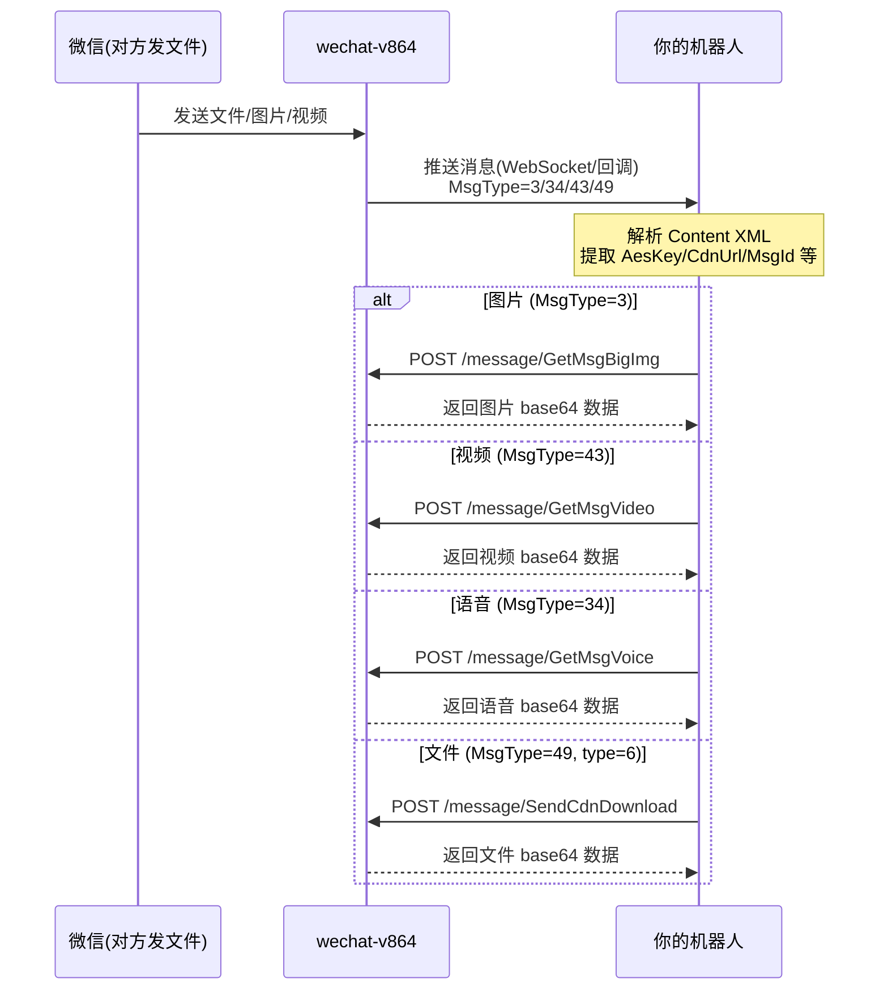

# wechat-v864 WebSocket 消息 & 文件收发 API 文档

> 本文档基于 [wechat-v864](file:///root/wechat-v864) 源码整理，涵盖消息接收和所有文件/媒体相关 API。
> 
> **BASE_URL**: `http://你的IP:8099`  
> **所有接口都需要 `?key=你的TOKEN_KEY` 参数**

---

## 一、接收消息

### 1. WebSocket 方式（推荐，实时）

**连接地址**:
```
ws://你的IP:8099/ws/GetSyncMsg?key=你的TOKEN_KEY
```

**收到的消息格式**（JSON，来自 protobuf [AddMsg](file:///root/wechat-v864/srv/wxtask/wxsocketmsg.go#138-164) 序列化）:
```json
{
  "FromUserName": {"Str": "wxid_xxxxxx"},
  "ToUserName": {"Str": "wxid_yyyyyy"},
  "MsgType": 1,
  "Content": {"Str": "你好"},
  "MsgId": 123456789,
  "NewMsgId": 9876543210,
  "CreateTime": 1708617600,
  "PushContent": "张三: 你好"
}
```

**Python 连接示例**:
```python
import asyncio, websockets, json

async def listen():
    uri = "ws://127.0.0.1:8099/ws/GetSyncMsg?key=你的TOKEN_KEY"
    async with websockets.connect(uri) as ws:
        print("✅ WebSocket 已连接")
        async for message in ws:
            data = json.loads(message)
            msg_type = data.get("MsgType", 0)
            content = data.get("Content", {}).get("Str", "")
            from_user = data.get("FromUserName", {}).get("Str", "")
            print(f"[类型:{msg_type}] {from_user}: {content}")

asyncio.run(listen())
```

### 2. HTTP 回调方式

**设置回调 URL**:
```
POST /forward/SetForward?key=TOKEN_KEY
Body: {"url": "http://你的机器人地址:端口/callback"}
```

**回调推送的数据格式**:
```json
{
  "msgType": 1,
  "msgContent": "你好",
  "FromUserName": "wxid_xxxxxx",
  "ToUserName": "wxid_yyyyyy",
  "pushContent": "张三: 你好",
  "beAtUser": "",
  "msg_id": 123456789,
  "new_msg_id": 9876543210
}
```

### 3. HTTP 轮询方式

```
POST /message/HttpSyncMsg?key=TOKEN_KEY
Body: {"Count": 0}   // 0 = 获取所有待同步消息
```

---

## 二、消息类型参考

| MsgType | 含义 | 说明 |
|---|---|---|
| **1** | 文本消息 | `Content` 为文本内容 |
| **3** | 图片消息 | `Content` 含图片 XML，需通过 API 下载 |
| **34** | 语音消息 | 需通过 API 下载 |
| **43** | 视频消息 | 需通过 API 下载 |
| **47** | 表情包 | 含 emoji XML |
| **48** | 位置消息 | 含经纬度 XML |
| **49** | 引用/链接/文件 | 子类型通过 XML `<type>` 区分 |
| **10000** | 系统消息 | 如 "你已添加了xxx" |
| **10002** | 撤回消息 | 含被撤回消息的 ID |

> [!TIP]
> **MsgType=49** 是复合类型，通过 `Content` XML 中的 `<type>` 子标签区分：
> - `<type>6</type>` = 文件
> - `<type>57</type>` = 引用消息
> - `<type>5</type>` = 链接
> - `<type>33</type>` / `<type>36</type>` = 小程序

---

## 三、发送消息 API

### 发送文本消息
```
POST /message/SendTextMessage?key=TOKEN_KEY
```
```json
{
  "MsgItem": [{
    "ToUserName": "wxid_xxxxxx",
    "TextContent": "你好！",
    "MsgType": 1,
    "AtWxIDList": []
  }]
}
```
> 群聊 @某人：`AtWxIDList` 填入要 @的 wxid，`TextContent` 中 @的名字前加空格

### 发送图片消息
```
POST /message/SendImageMessage?key=TOKEN_KEY
```
```json
{
  "MsgItem": [{
    "ToUserName": "wxid_xxxxxx",
    "ImageContent": "base64编码的图片数据",
    "MsgType": 2
  }]
}
```

### 发送语音消息
```
POST /message/SendVoice?key=TOKEN_KEY
```
```json
{
  "ToUserName": "wxid_xxxxxx",
  "VoiceData": "base64编码的语音数据(silk格式)",
  "VoiceSecond": 5,
  "VoiceFormat": 4
}
```

### 上传/发送视频
```
POST /message/CdnUploadVideo?key=TOKEN_KEY
```
```json
{
  "ToUserName": "wxid_xxxxxx",
  "VideoData": "base64编码的视频数据",
  "ThumbData": "base64编码的缩略图"
}
```

### 发送表情
```
POST /message/SendEmojiMessage?key=TOKEN_KEY
```
```json
{
  "EmojiList": [{
    "ToUserName": "wxid_xxxxxx",
    "EmojiMd5": "表情MD5",
    "EmojiSize": 12345
  }]
}
```

### 转发图片
```
POST /message/ForwardImageMessage?key=TOKEN_KEY
```
```json
{
  "ForwardImageList": [{
    "ToUserName": "wxid_xxxxxx",
    "AesKey": "从收到的图片消息XML中提取",
    "CdnMidImgUrl": "从收到的图片消息XML中提取",
    "CdnMidImgSize": 12345,
    "CdnThumbImgSize": 1234
  }]
}
```

### 转发视频
```
POST /message/ForwardVideoMessage?key=TOKEN_KEY
```
```json
{
  "ForwardVideoList": [{
    "ToUserName": "wxid_xxxxxx",
    "AesKey": "从视频消息XML中提取",
    "CdnVideoUrl": "从视频消息XML中提取",
    "Length": 1234567,
    "PlayLength": 15,
    "CdnThumbLength": 5678
  }]
}
```

### 发送链接/App 消息
```
POST /message/SendAppMessage?key=TOKEN_KEY
```
```json
{
  "AppList": [{
    "ToUserName": "wxid_xxxxxx",
    "ContentXML": "<appmsg>...(完整的XML)...</appmsg>",
    "ContentType": 5
  }]
}
```

### 分享名片
```
POST /message/ShareCardMessage?key=TOKEN_KEY
```
```json
{
  "ToUserName": "wxid_接收者",
  "CardWxId": "wxid_名片对象",
  "CardNickName": "名片昵称",
  "CardAlias": "",
  "CardFlag": 0
}
```

---

## 四、下载/接收文件媒体 API

### 下载高清图片
```
POST /message/GetMsgBigImg?key=TOKEN_KEY
```
```json
{
  "MsgId": 123456789,
  "TotalLen": 0,
  "Section": {
    "StartPos": 0,
    "DataLen": 61440
  },
  "ToUserName": "wxid_接收者",
  "FromUserName": "wxid_发送者",
  "CompressType": 0
}
```
> `MsgId` 使用消息中的 `msg_id`（非 `new_msg_id`），`TotalLen` 首次可传 0，响应会返回总大小，分段下载

### 下载视频
```
POST /message/GetMsgVideo?key=TOKEN_KEY
```
```json
{
  "MsgId": 123456789,
  "TotalLen": 0,
  "Section": {
    "StartPos": 0,
    "DataLen": 61440
  },
  "ToUserName": "wxid_接收者",
  "FromUserName": "wxid_发送者",
  "CompressType": 0
}
```

### 下载语音
```
POST /message/GetMsgVoice?key=TOKEN_KEY
```
```json
{
  "ToUserName": "wxid_接收者",
  "NewMsgId": "9876543210",
  "Bufid": "bufid值",
  "Length": 12345
}
```

### CDN 文件下载（通用媒体下载）
```
POST /message/SendCdnDownload?key=TOKEN_KEY
```
```json
{
  "AesKey": "从消息XML中提取的aeskey",
  "FileURL": "从消息XML中提取的cdnurl",
  "FileType": 1
}
```

### 文件附件下载（分段下载）
```
POST /message/SendDownloadFile?key=TOKEN_KEY
```
```json
{
  "AppID": "wx123456",
  "AttachId": "附件ID",
  "TotalLen": 1234567,
  "Section": {
    "StartPos": 0,
    "DataLen": 61440
  },
  "ToUserName": "wxid_接收者"
}
```

### 上传文件附件
```
POST /other/UploadAppAttachApi?key=TOKEN_KEY
```
```json
{
  "FileData": "base64编码的文件数据"
}
```

---

## 五、收到文件消息的处理流程



---

## 六、群消息特殊处理

群消息中，`FromUserName` 为群 ID（`xxxx@chatroom`），`Content` 格式为：
```
发送者wxid:\n实际消息内容
```

**解析示例**（Python）:
```python
def parse_group_msg(from_user, content):
    if from_user.endswith("@chatroom"):
        # 群消息
        parts = content.split(":\n", 1)
        sender = parts[0]         # 发送者 wxid
        real_content = parts[1]   # 实际消息内容
        group_id = from_user      # 群 ID
        return group_id, sender, real_content
    else:
        # 私聊消息
        return None, from_user, content
```
