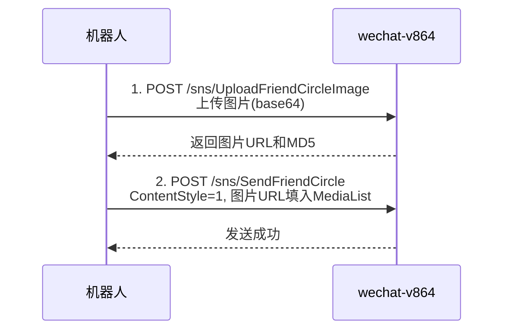
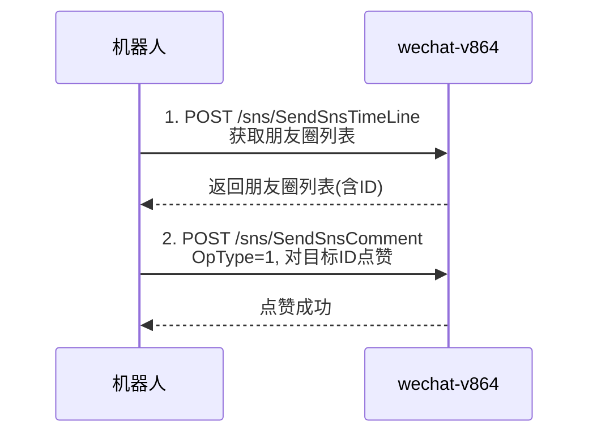

# 朋友圈 API 工具文档

> **BASE_URL**: `http://127.0.0.1:8099`
> 所有接口都需要 URL 参数 `?key=你的API令牌`

---

## 📖 浏览朋友圈

### 1. 获取朋友圈主页（Timeline）

刷朋友圈首页，和微信下拉刷新一样。

```
POST /sns/SendSnsTimeLine?key=你的KEY
```

**请求体**：
```json
{
  "FirstPageMD5": "",
  "MaxID": 0
}
```

| 参数 | 说明 |
|---|---|
| `FirstPageMD5` | 首页 MD5，首次请求留空，翻页时传上次返回的值 |
| `MaxID` | 翻页用，首次传 `0`，翻页时传上次返回列表中最后一条的 ID |

---

### 2. 获取指定好友的朋友圈

查看某个好友的朋友圈主页。

```
POST /sns/SendSnsUserPage?key=你的KEY
```

**请求体**：
```json
{
  "UserName": "wxid_xxxxxxxx",
  "FirstPageMD5": "",
  "MaxID": 0
}
```

| 参数 | 说明 |
|---|---|
| `UserName` | 好友的 wxid |
| `FirstPageMD5` | 翻页 MD5，首次留空 |
| `MaxID` | 翻页 ID，首次传 `0` |

---

### 3. 通过 ID 获取朋友圈详情

获取指定朋友圈的完整内容（含评论/点赞）。

```
POST /sns/SendSnsObjectDetailById?key=你的KEY
```

```json
{
  "Id": "14120077901807288743"
}
```

---

### 4. 同步朋友圈新消息

获取朋友圈的新通知（新评论、新点赞等）。

```
POST /sns/GetSnsSync?key=你的KEY
```

请求体为空 `{}` 即可。

---

## 📝 发送朋友圈

### 5. 发送朋友圈（通用）

支持纯文字、图文、视频、链接。

```
POST /sns/SendFriendCircle?key=你的KEY
```

#### 纯文字朋友圈

```json
{
  "ContentStyle": 2,
  "Privacy": 0,
  "Content": "今天天气真好 ☀️"
}
```

#### 图文朋友圈

> 先调用 **上传图片接口** 获取图片 URL，再发送

```json
{
  "ContentStyle": 1,
  "Privacy": 0,
  "Content": "休闲时刻😚",
  "MediaList": [
    {
      "ID": 1,
      "Type": 2,
      "URL": "上传接口返回的图片URL",
      "URLType": "1",
      "Thumb": "上传接口返回的缩略图URL",
      "ThumType": "1",
      "SizeWidth": "800",
      "SizeHeight": "800",
      "TotalSize": "126335",
      "MD5": "图片MD5"
    }
  ]
}
```

#### 视频朋友圈

```json
{
  "ContentStyle": 15,
  "Privacy": 0,
  "Content": "精彩视频",
  "MediaList": [
    {
      "ID": 1,
      "Type": 2,
      "URL": "视频URL",
      "Thumb": "视频封面URL",
      "URLType": "1",
      "ThumType": "1",
      "SizeWidth": "800",
      "SizeHeight": "800"
    }
  ]
}
```

#### 链接朋友圈

```json
{
  "ContentStyle": 3,
  "ContentUrl": "https://example.com/article",
  "Description": "文章标题",
  "Privacy": 0,
  "Content": "推荐这篇文章",
  "MediaList": [
    {
      "ID": 1,
      "Type": 2,
      "URL": "链接缩略图URL",
      "Thumb": "链接缩略图URL",
      "Title": "文章来源名称"
    }
  ]
}
```

**通用参数说明**：

| 参数 | 值 | 说明 |
|---|---|---|
| `ContentStyle` | `1` = 图文, `2` = 纯文字, `3` = 链接, `15` = 视频 | 朋友圈类型 |
| `Privacy` | `0` = 公开, `1` = 仅自己可见 | 可见范围 |
| `Content` | 字符串 | 朋友圈文案 |
| `WithUserList` | `["wxid_xxx"]` | 提醒谁看（@好友） |
| `GroupUserList` | `["wxid_xxx"]` | 仅这些好友可见 |
| `BlackList` | `["wxid_xxx"]` | 这些好友不可见 |
| `LocationInfo` | 对象 | 添加位置，见下方 |

**位置信息结构**：
```json
{
  "LocationInfo": {
    "City": "北京",
    "PoiName": "天安门广场",
    "PoiAddress": "北京市东城区",
    "Longitude": "116.397128",
    "Latitude": "39.916527"
  }
}
```

---

### 6. 通过 XML 发送朋友圈

用原始 XML 格式发送（高级用法，可自定义更多字段）。

```
POST /sns/SendFriendCircleByXMl?key=你的KEY
```

请求体为 `TimelineObject` XML 对应的 JSON 结构。

---

## 🖼️ 上传媒体

### 7. 上传朋友圈图片

发图文朋友圈前必须先上传图片。

```
POST /sns/UploadFriendCircleImage?key=你的KEY
```

```json
{
  "ImageDataList": [
    "base64编码的图片数据1",
    "base64编码的图片数据2"
  ]
}
```

> [!TIP]
> 支持批量上传。返回的 `resp` 中包含每张图片的 URL 和 MD5，用于填入 `SendFriendCircle` 的 `MediaList`。

---

### 8. 上传朋友圈视频

```
POST /sns/CdnSnsVideoUploadApi?key=你的KEY
```

```json
{
  "VideoData": "视频文件的base64编码",
  "ThumbData": "视频封面图片的base64编码"
}
```

---

### 9. 下载朋友圈视频

```
POST /sns/DownloadMedia?key=你的KEY
```

```json
{
  "Key": "视频加密Key",
  "URL": "视频CDN地址"
}
```

---

## 💬 互动操作

### 10. 点赞 / 评论

```
POST /sns/SendSnsComment?key=你的KEY
```

#### 点赞

```json
{
  "SnsCommentList": [
    {
      "OpType": 1,
      "ItemID": "朋友圈ID",
      "ToUserName": "发布者的wxid"
    }
  ]
}
```

#### 评论

```json
{
  "SnsCommentList": [
    {
      "OpType": 2,
      "ItemID": "朋友圈ID",
      "ToUserName": "发布者的wxid",
      "Content": "写得真好！"
    }
  ]
}
```

#### 回复评论

```json
{
  "SnsCommentList": [
    {
      "OpType": 2,
      "ItemID": "朋友圈ID",
      "ToUserName": "发布者的wxid",
      "Content": "谢谢夸奖~",
      "ReplyCommentID": 1,
      "ReplyItem": {
        "UserName": "被回复者wxid",
        "NickName": "被回复者昵称",
        "OpType": 2,
        "Source": 0
      }
    }
  ]
}
```

| OpType | 含义 |
|---|---|
| `1` | 点赞 |
| `2` | 评论 |

---

### 11. 朋友圈操作（删除等）

```
POST /sns/SendSnsObjectOp?key=你的KEY
```

```json
{
  "SnsObjectOpList": [
    {
      "SnsObjID": "朋友圈ID",
      "OpType": 1
    }
  ]
}
```

---

## 🔄 转发朋友圈

### 12. 一键转发朋友圈

通过朋友圈 ID 一键转发到自己的朋友圈。

```
POST /sns/SendOneIdCircle?key=你的KEY
```

```json
{
  "Id": "朋友圈ID"
}
```

---

### 13. 转发收藏的朋友圈

```
POST /sns/SendFavItemCircle?key=你的KEY
```

```json
{
  "SourceID": "收藏来源ID",
  "FavItemID": 12345
}
```

---

### 14. 获取收藏朋友圈详情

```
POST /sns/GetCollectCircle?key=你的KEY
```

```json
{
  "SourceID": "收藏来源ID",
  "FavItemID": 12345
}
```

---

## ⚙️ 设置

### 15. 设置朋友圈可见天数

```
POST /sns/SetFriendCircleDays?key=你的KEY
```

```json
{
  "Function": 4,
  "Value": 0
}
```

| Value | 含义 |
|---|---|
| `0` | 全部可见 |
| `3` | 最近三天 |
| `30` | 最近一个月 |
| `180` | 最近半年 |

---

### 16. 设置朋友圈背景图

```
POST /sns/SetBackgroundImage?key=你的KEY
```

```json
{
  "Url": "图片URL地址"
}
```

---

## 🚀 典型使用流程

### 发送图文朋友圈完整流程：



### 浏览并点赞朋友圈流程：


