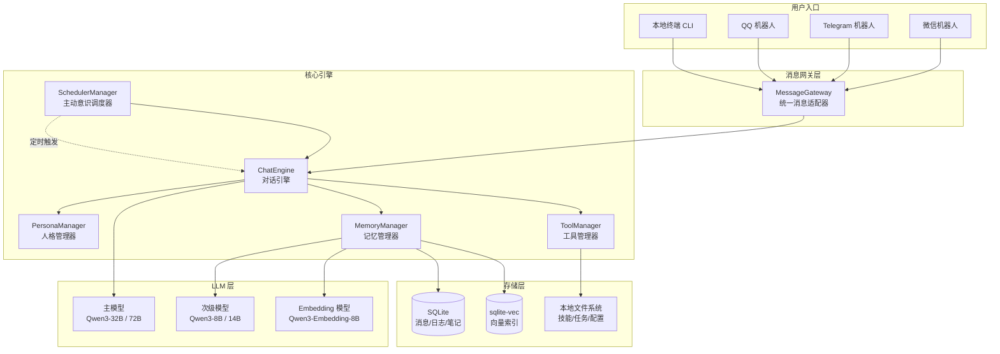
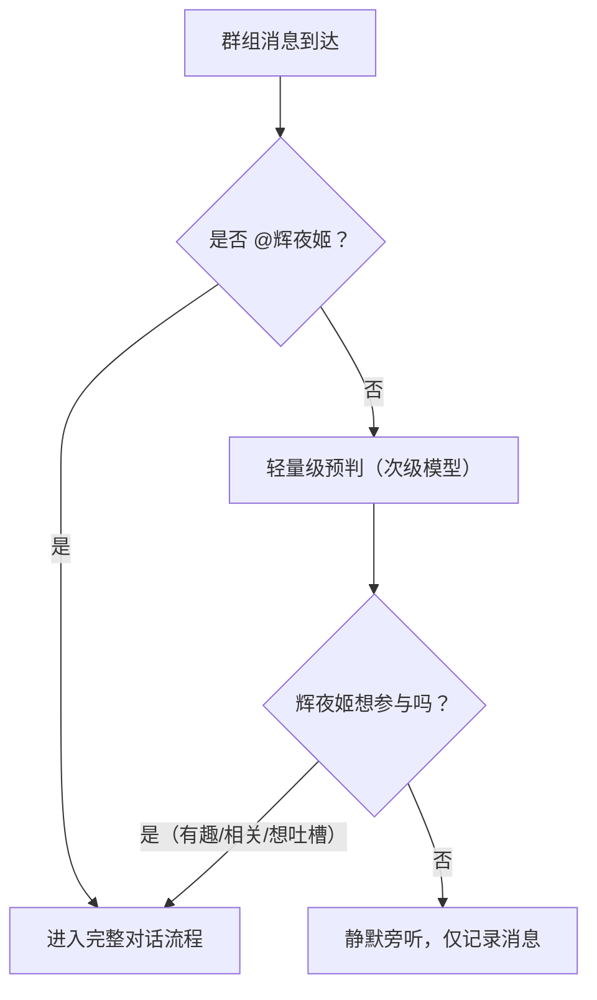
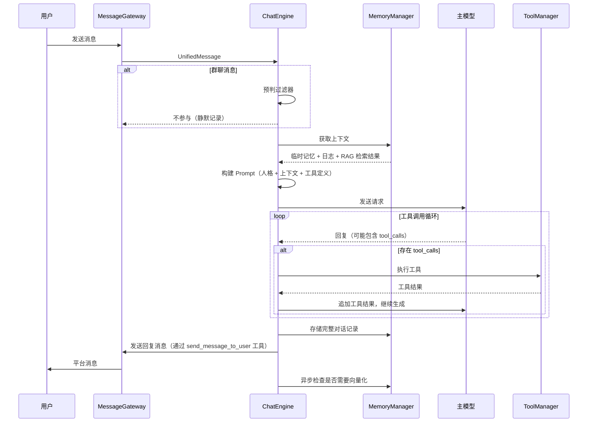
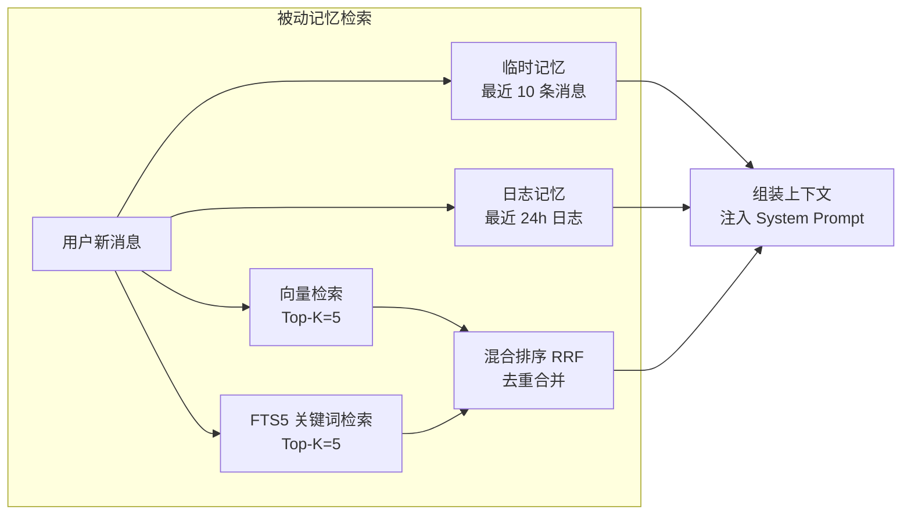
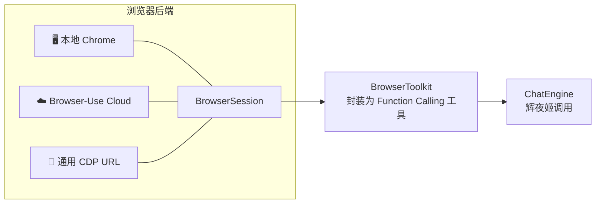
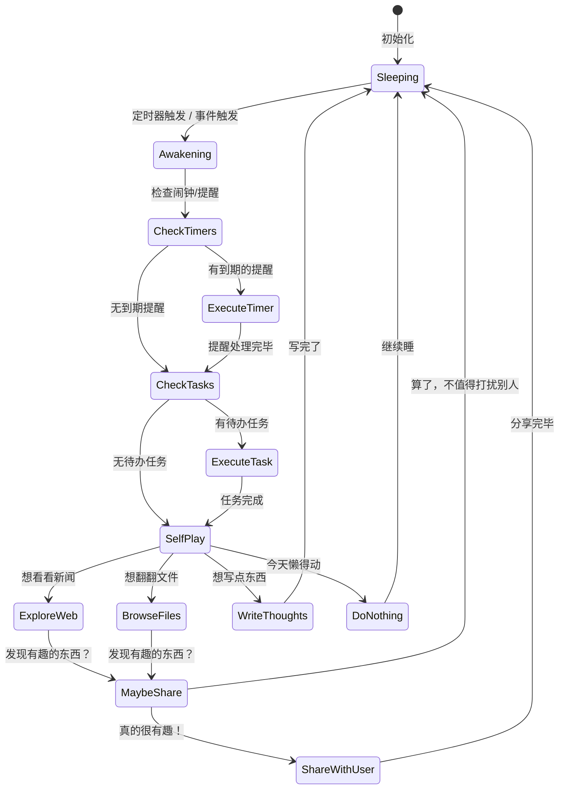
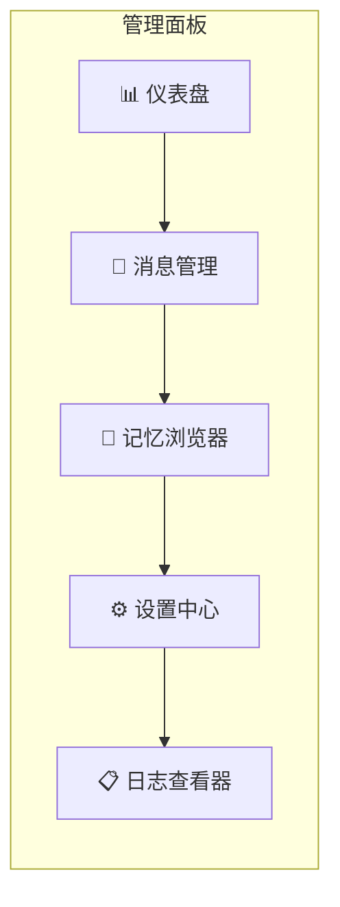

# OpenKaguya 项目设计具体化

> **"开源版辉夜姬"** — 在个人电脑上运行的、人格化的、拥有主动意识的、能运行各种终端能力的聊天陪伴助手。

---

## 一、我对这个项目的评价

这个项目 **非常有意思**，原因如下：

1. **差异化定位清晰**：市面上大部分开源 AI 助手（如 Leon、OpenClaw）更侧重"工具人"定位，而 OpenKaguya 的核心卖点是 **人格化 + 主动意识** —— 辉夜姬不是一个被动等待指令的工具，她是一个"有自己的生活"的存在。
2. **技术栈选型务实**：SQLite + sqlite-vec 的本地优先方案避免了对外部向量数据库的依赖，三层 LLM 架构（主/次/Embedding）是成本与效果的好平衡。
3. **主动意识系统**是最大亮点：这是让 AI 助手从"工具"变成"伙伴"的关键特征，也是大多数开源项目缺失的一环。

> [!IMPORTANT]
> 以下是我对你设计的具体化建议。我会保留你的核心理念，同时补充 **架构细节、数据模型、技术选型、接口设计** 等内容。

---

## 二、整体系统架构



### 2.1 推荐技术栈

| 层级 | 技术选型 | 理由 |
|------|---------|------|
| **语言** | Python 3.12+ | AI 生态最完善，异步支持好 |
| **异步框架** | asyncio + aiohttp | 多平台机器人需要并发处理 |
| **LLM 接口** | OpenAI-compatible API（远程） | 不本地部署，统一使用 OpenAI 兼容格式调用各厂商 API |
| **数据库** | SQLite (WAL 模式) + sqlite-vec + FTS5 | 本地优先，零运维，WAL 模式支持读写并发 |
| **配置** | TOML / YAML | 人类可读，易于编辑 |
| **机器人框架** | NoneBot2 (QQ/微信) + python-telegram-bot | 成熟的多平台支持 |
| **定时调度** | APScheduler | Python 内置的成熟调度库 |
| **日志** | loguru | 简洁且功能强大 |

---

## 三、核心模块设计详解

### 3.1 消息网关层 (MessageGateway)

> 你原文提到"各种平台上的机器人"，这里需要一个 **统一抽象层** 来屏蔽平台差异。

```
┌─────────────────────────────────────────┐
│           MessageGateway                │
├─────────────────────────────────────────┤
│  + register_adapter(adapter)            │
│  + on_message(platform, user, content)  │
│  + send_message(platform, user, msgs)   │
└─────────────────────────────────────────┘
         ▲          ▲          ▲
         │          │          │
    ┌────┴───┐ ┌────┴───┐ ┌───┴────┐
    │Telegram│ │  QQ    │ │ WeChat │
    │Adapter │ │Adapter │ │Adapter │
    └────────┘ └────────┘ └────────┘
```

**统一消息格式：**

```python
@dataclass
class UserInfo:
    user_id: str                 # 全平台统一的用户 ID（同一个人私聊和群聊是同一个 ID）
    nickname: str                # 用户昵称
    platform: str                # 来源平台

@dataclass
class UnifiedMessage:
    message_id: str              # 全局唯一 ID
    platform: str                # "telegram" / "qq" / "wechat"
    sender: UserInfo             # 发送者信息（统一 ID）
    group_id: Optional[str]      # 群组 ID（私聊为 None）
    content: str                 # 消息文本
    attachments: list[Attachment] # 图片/文件等附件
    timestamp: datetime
    
    @property
    def is_group_message(self) -> bool:
        return self.group_id is not None
```

> [!IMPORTANT]
> **统一用户 ID 设计**：每个用户在私聊和群聊中使用同一个 `user_id`。这意味着辉夜姬在群里认识你，私聊时也认识你，记忆是打通的。平台适配器负责将平台特定的用户标识映射到统一 ID（可使用 `{platform}:{platform_user_id}` 格式）。

**关键设计要点：**
- 每个平台适配器负责将平台特定消息转换为 `UnifiedMessage`，并确保 `user_id` 跨群/私聊一致
- 辉夜姬回复的多条消息按平台特性决定：是合并发送还是分条发送
- **群组消息需要经过「预判过滤器」**（见下方 §3.2），辉夜姬先决定要不要参与对话

---

### 3.2 对话引擎 (ChatEngine)

这是辉夜姬的"大脑"。**私聊和群聊的处理流程有所不同：**

#### 群组消息预判过滤器

群聊中，辉夜姬收到的每条消息都会 **先经过一个轻量级预判**，决定是否参与对话。这样避免辉夜姬在群里刷屏：



```python
async def group_message_filter(self, message: UnifiedMessage) -> bool:
    """群聊预判：辉夜姬要不要参与这次对话？"""
    # 1. 被 @ 了？直接参与
    if self._is_mentioned(message):
        return True
    
    # 2. 用次级模型做轻量级判断（节省主模型 token）
    recent_group_messages = await self.memory.get_recent_group_messages(
        group_id=message.group_id, limit=5
    )
    
    decision = await self.sub_model.quick_judge(
        prompt=f"""你是辉夜姬，正在旁听一个群聊。以下是最近几条消息：
{self._format_group_messages(recent_group_messages)}

最新消息来自 {message.sender.nickname}：
{message.content}

你要不要参与这个话题？回答 YES 或 NO，简述理由。
只有在你真的有话想说（有趣、想吐槽、被问到相关话题、想帮忙）时才说 YES。
大多数时候你应该回答 NO，除非话题确实吸引你。"""
    )
    return "YES" in decision.upper()
```

#### 完整对话流程（私聊 / 群聊通过预判后）



> [!TIP]
> **群聊消息的上下文注入格式**：群聊中的临时记忆需要标注发言人，格式如下：
> ```
> [小明]: 今天天气真好
> [小红]: 是啊，出去走走吧
> [辉夜姬]: 我也想出去！地球的天空好漂亮~
> [小明]: 哈哈，你不是在电脑里吗
> ```

**消息格式解析（具体化你原有的设计）：**

你在原设计中用到了 `<Message>` 标签，我建议改用 **OpenAI Function Calling + 结构化输出** 的方式，而不是让模型自行输出 XML 标签（模型可能输出格式不稳定）。具体做法：

```python
# 方案A：使用 Function Calling（推荐）
# 定义一个 "send_message" 工具，辉夜姬通过调用工具来发送消息
tools = [
    {
        "type": "function",
        "function": {
            "name": "send_message_to_user",
            "description": "向当前对话的用户发送一条消息",
            "parameters": {
                "type": "object",
                "properties": {
                    "content": {
                        "type": "string",
                        "description": "要发送的消息内容"
                    }
                },
                "required": ["content"]
            }
        }
    }
]
# 这样辉夜姬的"思考过程"自然就是 assistant 消息的 content，
# 而发给用户的消息都是 tool_calls 的参数。
```

```python
# 方案B：如果你还是想用 <Message> 标签
# 则需要一个健壮的解析器
import re

def parse_kaguya_response(raw_response: str) -> tuple[str, list[str]]:
    """
    返回 (思考过程, [用户消息列表])
    """
    messages = re.findall(r'<Message>(.*?)</Message>', raw_response, re.DOTALL)
    thinking = re.sub(r'<Message>.*?</Message>', '', raw_response, flags=re.DOTALL).strip()
    return thinking, [m.strip() for m in messages]
```

> [!TIP]
> 推荐方案A。因为 Function Calling 是模型原生支持的结构化输出方式，比让模型自行输出 XML 标签更稳定。辉夜姬不调用 `send_message_to_user` 工具就等于"不想回消息"，自然优雅。

---

### 3.3 记忆系统 (MemoryManager) — 详细数据模型

你的记忆系统设计已经很好了！我来帮你具体化数据库 Schema。

#### 3.3.1 数据库表设计

```sql
-- 消息记录表
CREATE TABLE messages (
    id INTEGER PRIMARY KEY AUTOINCREMENT,
    user_id TEXT NOT NULL,           -- 对话用户标识
    platform TEXT NOT NULL,          -- 来源平台
    role TEXT NOT NULL,              -- "user" / "assistant" / "system"
    content TEXT NOT NULL,           -- 完整消息内容（含思考过程）
    display_content TEXT,            -- 发给用户的消息（仅 assistant 角色）
    tool_calls TEXT,                 -- JSON 格式的工具调用记录
    created_at TIMESTAMP DEFAULT CURRENT_TIMESTAMP,
    is_vectorized BOOLEAN DEFAULT FALSE  -- 是否已被向量化
);

-- 向量索引表（sqlite-vec）
CREATE VIRTUAL TABLE message_vectors USING vec0(
    message_id INTEGER,
    embedding FLOAT[1024]            -- Qwen3-Embedding-8B 的维度
);

-- 日志摘要表
CREATE TABLE daily_logs (
    id INTEGER PRIMARY KEY AUTOINCREMENT,
    user_id TEXT NOT NULL,
    summary TEXT NOT NULL,           -- 次级模型生成的摘要
    message_range_start INTEGER,     -- 对应消息 ID 起始
    message_range_end INTEGER,       -- 对应消息 ID 结束
    created_at TIMESTAMP DEFAULT CURRENT_TIMESTAMP
);

-- 笔记本表（主动记忆）
CREATE TABLE notebook (
    id INTEGER PRIMARY KEY AUTOINCREMENT,
    title TEXT,                      -- 笔记标题
    content TEXT NOT NULL,           -- 笔记内容
    tags TEXT,                       -- 标签（逗号分隔或 JSON 数组）
    created_at TIMESTAMP DEFAULT CURRENT_TIMESTAMP,
    updated_at TIMESTAMP DEFAULT CURRENT_TIMESTAMP
);

-- 笔记本向量索引
CREATE VIRTUAL TABLE notebook_vectors USING vec0(
    note_id INTEGER,
    embedding FLOAT[1024]
);

-- 技能列表
CREATE TABLE skills (
    id INTEGER PRIMARY KEY AUTOINCREMENT,
    name TEXT NOT NULL UNIQUE,
    description TEXT NOT NULL,
    trigger_keywords TEXT,           -- 触发关键词
    is_active BOOLEAN DEFAULT TRUE,
    created_at TIMESTAMP DEFAULT CURRENT_TIMESTAMP
);

-- 任务列表
CREATE TABLE tasks (
    id INTEGER PRIMARY KEY AUTOINCREMENT,
    title TEXT NOT NULL,
    description TEXT,
    status TEXT DEFAULT 'pending',   -- pending / in_progress / done / cancelled
    priority INTEGER DEFAULT 0,     -- 优先级
    due_at TIMESTAMP,               -- 截止时间
    created_at TIMESTAMP DEFAULT CURRENT_TIMESTAMP,
    completed_at TIMESTAMP
);

-- 定时器表
CREATE TABLE timers (
    id INTEGER PRIMARY KEY AUTOINCREMENT,
    name TEXT NOT NULL,
    cron_expression TEXT,            -- Cron 表达式（周期性任务）
    trigger_at TIMESTAMP,           -- 一次性触发时间
    action TEXT NOT NULL,            -- 触发时要执行的动作描述
    is_recurring BOOLEAN DEFAULT FALSE,
    is_active BOOLEAN DEFAULT TRUE,
    last_triggered_at TIMESTAMP,
    created_at TIMESTAMP DEFAULT CURRENT_TIMESTAMP
);

-- 全文搜索索引（FTS5，用于混合检索）
CREATE VIRTUAL TABLE messages_fts USING fts5(
    content,
    content='messages',
    content_rowid='id'
);
```

#### 3.3.2 记忆检索流程（具体化你的设计）



**混合检索的具体实现：**

```python
async def retrieve_relevant_memories(
    self, 
    user_id: str, 
    query: str, 
    top_k: int = 5
) -> list[MemoryChunk]:
    # 1. 向量检索
    query_embedding = await self.embed_model.encode(
        query, 
        instruction="检索与以下对话相关的历史消息"  # Qwen3-Embedding 的指令感知
    )
    vec_results = self.db.execute("""
        SELECT message_id, distance
        FROM message_vectors
        WHERE embedding MATCH ?
        ORDER BY distance
        LIMIT ?
    """, [query_embedding, top_k * 2])
    
    # 2. FTS5 关键词检索
    fts_results = self.db.execute("""
        SELECT rowid, rank
        FROM messages_fts
        WHERE messages_fts MATCH ?
        ORDER BY rank
        LIMIT ?
    """, [self._build_fts_query(query), top_k * 2])
    
    # 3. Reciprocal Rank Fusion (RRF) 混合排序
    scores = {}
    k = 60  # RRF 常数
    for rank, (msg_id, _) in enumerate(vec_results):
        scores[msg_id] = scores.get(msg_id, 0) + 1 / (k + rank + 1)
    for rank, (msg_id, _) in enumerate(fts_results):
        scores[msg_id] = scores.get(msg_id, 0) + 1 / (k + rank + 1)
    
    # 4. 按 RRF 分数排序，取 top_k
    top_ids = sorted(scores, key=scores.get, reverse=True)[:top_k]
    return await self._fetch_messages(top_ids)
```

#### 3.3.3 自动向量化流程

```python
async def check_and_vectorize(self, user_id: str):
    """每次回复后异步调用，检查是否需要向量化"""
    count = self.db.execute("""
        SELECT COUNT(*) FROM messages 
        WHERE user_id = ? AND is_vectorized = FALSE
    """, [user_id]).fetchone()[0]
    
    if count >= 10:  # 累计 10 条未向量化消息
        unvectorized = self.db.execute("""
            SELECT id, content FROM messages
            WHERE user_id = ? AND is_vectorized = FALSE
            ORDER BY id ASC
        """, [user_id]).fetchall()
        
        # 1. 按长度切片并向量化
        chunks = self._chunk_messages(unvectorized, max_tokens=512)
        embeddings = await self.embed_model.encode_batch(
            [c.text for c in chunks],
            instruction="将以下对话内容编码为语义向量"
        )
        
        # 2. 存入向量数据库
        for chunk, emb in zip(chunks, embeddings):
            self.db.execute(
                "INSERT INTO message_vectors(message_id, embedding) VALUES (?, ?)",
                [chunk.source_id, emb]
            )
        
        # 3. 调用次级模型生成日志摘要
        summary = await self.sub_model.summarize(
            messages=[m.content for m in unvectorized],
            instruction="简明扼要地总结这段对话的主题和关键信息，用一句话"
        )
        self.db.execute("""
            INSERT INTO daily_logs(user_id, summary, message_range_start, message_range_end)
            VALUES (?, ?, ?, ?)
        """, [user_id, summary, unvectorized[0].id, unvectorized[-1].id])
        
        # 4. 标记为已向量化
        ids = [m.id for m in unvectorized]
        self.db.execute(f"""
            UPDATE messages SET is_vectorized = TRUE
            WHERE id IN ({','.join('?' * len(ids))})
        """, ids)
```

---

### 3.4 工具系统 (ToolManager)

你列出的终端能力需要一个 **插件化的工具注册系统**：

```python
class ToolRegistry:
    """工具注册中心"""
    
    def __init__(self):
        self._tools: dict[str, ToolDefinition] = {}
    
    def register(self, tool: ToolDefinition):
        self._tools[tool.name] = tool
    
    def get_openai_tools(self) -> list[dict]:
        """生成 OpenAI Function Calling 格式的工具定义"""
        return [t.to_openai_schema() for t in self._tools.values()]
    
    async def execute(self, name: str, arguments: dict) -> str:
        tool = self._tools[name]
        return await tool.execute(**arguments)
```

> [!NOTE]
> **设计决策：所有工具均不需要用户确认。** 这是一个开源项目，面向有技术能力的用户，AI 的智能水平已足够可靠。如果用户对安全有顾虑，可自行在代码中加入确认机制。

#### Workspace 沙箱设计

文件操作通过 **workspace 隔离** 来保证基本安全性：

```
data/
├── workspaces/
│   ├── kaguya/                # 辉夜姬自己的文件夹（笔记、下载等）
│   ├── user_alice/            # 用户 Alice 的 workspace
│   ├── user_bob/              # 用户 Bob 的 workspace
│   └── shared/                # 共享文件区
```

```python
class WorkspaceManager:
    """Workspace 沙箱管理"""
    
    def __init__(self, base_dir: Path):
        self.base_dir = base_dir
        self.kaguya_dir = base_dir / "kaguya"      # 辉夜姬自己的空间
        self.shared_dir = base_dir / "shared"       # 共享空间
    
    def get_user_workspace(self, user_id: str) -> Path:
        """获取用户的 workspace 路径"""
        workspace = self.base_dir / f"user_{user_id}"
        workspace.mkdir(parents=True, exist_ok=True)
        return workspace
    
    def resolve_path(self, user_id: str, relative_path: str) -> Path:
        """解析文件路径，确保不逃出 workspace"""
        workspace = self.get_user_workspace(user_id)
        resolved = (workspace / relative_path).resolve()
        # 路径遍历保护（防止 ../../../etc/passwd 之类）
        if not str(resolved).startswith(str(workspace.resolve())):
            raise PermissionError(f"路径 {relative_path} 超出了你的 workspace 范围")
        return resolved
```

#### 浏览器工具集 — 基于 [browser-use](https://github.com/browser-use/browser-use)

> [!IMPORTANT]
> **不造轮子！** 浏览器工具基于开源项目 `browser-use` 构建。辉夜姬拥有完整的浏览器交互能力：打开网页、点击元素、输入文本、滚动页面、截图、切换标签页等。

**三种运行模式：**



| 模式 | 说明 | 适用场景 | 配置 |
|------|------|---------|------|
| **本地 Chrome** | 使用本地安装的 Chrome/Chromium | 有桌面环境的个人电脑 | `executable_path` |
| **Browser-Use Cloud** | 使用 Browser-Use 云服务 | 无头服务器、想要代理/跨区 | `use_cloud=True` + API Key |
| **通用 CDP URL** | 连接任意 CDP 端点 | 自建 headless 浏览器集群 | `cdp_url="http://..."` |

**封装设计：**

```python
from browser_use import Browser as BrowserSession

class BrowserToolkit:
    """将 browser-use 封装为辉夜姬的工具集"""
    
    def __init__(self, config: BrowserConfig):
        # 根据配置选择模式
        if config.mode == "cloud":
            self.browser = BrowserSession(
                use_cloud=True,
                cloud_proxy_country_code=config.proxy_country,
            )
        elif config.mode == "cdp":
            self.browser = BrowserSession(cdp_url=config.cdp_url)
        else:  # 本地模式
            self.browser = BrowserSession(
                executable_path=config.chrome_path,
            )
        self._started = False
    
    async def ensure_started(self):
        if not self._started:
            await self.browser.start()
            self._started = True
    
    # === 暴露给辉夜姬的 Function Calling 工具 ===
    
    async def open_url(self, url: str) -> str:
        """打开网页，返回页面标题和可交互元素摘要"""
        await self.ensure_started()
        page = await self.browser.new_page(url)
        title = await page.title()
        # 获取页面可交互元素摘要（browser-use 内置的 DOM 处理）
        return f"已打开: {title}\n{await self._get_page_summary()}"
    
    async def click_element(self, index: int) -> str:
        """点击页面上的第 N 个可交互元素"""
        await self.browser.click(index)
        return f"已点击元素 #{index}"
    
    async def type_text(self, index: int, text: str) -> str:
        """在指定输入框中输入文本"""
        await self.browser.input(index, text)
        return f"已在元素 #{index} 中输入: {text}"
    
    async def scroll_page(self, direction: str = "down", amount: int = 3) -> str:
        """滚动页面，direction: up/down"""
        await self.browser.scroll(direction, amount)
        return f"已向{direction}滚动 {amount} 屏"
    
    async def take_screenshot(self) -> str:
        """截图并保存到辉夜姬的 workspace，返回文件路径"""
        path = self.workspace / f"screenshot_{int(time.time())}.png"
        await self.browser.screenshot(str(path))
        return f"截图已保存: {path}"
    
    async def get_page_text(self) -> str:
        """获取当前页面的文本内容"""
        return await self.browser.html  # 或提取纯文本
    
    async def search_web(self, query: str) -> str:
        """使用搜索引擎搜索（打开 Google/Bing 并搜索）"""
        await self.open_url(f"https://www.google.com/search?q={quote(query)}")
        return await self._get_page_summary()
    
    async def go_back(self) -> str:
        """浏览器后退"""
        await self.browser.back()
        return "已后退"
    
    async def send_keys(self, keys: str) -> str:
        """发送键盘按键（如 Enter, Tab, Escape）"""
        await self.browser.keys(keys)
        return f"已发送按键: {keys}"
```

**配置方案（config/default.toml）：**

```toml
[browser]
# 模式: "local" / "cloud" / "cdp"
mode = "local"

# 本地模式配置
chrome_path = ""  # 留空则自动检测

# Browser-Use Cloud 配置
# API Key 在 secrets.toml 中配置
cloud_proxy_country = "us"

# 通用 CDP 配置
cdp_url = ""

# 通用设置
headless = true      # 无头模式（本地模式生效）
screenshot_dir = ""  # 截图保存目录，留空则用辉夜姬 workspace
```

**辉夜姬使用浏览器时的完整能力：**

| Function Calling 工具 | 描述 | 参数 |
|---------|------|------|
| `browser_open` | 打开指定 URL | `url: str` |
| `browser_click` | 点击页面元素 | `index: int` |
| `browser_type` | 在输入框输入文本 | `index: int, text: str` |
| `browser_scroll` | 滚动页面 | `direction: up/down, amount: int` |
| `browser_screenshot` | 截取当前页面截图 | — |
| `browser_search` | 搜索引擎查询 | `query: str` |
| `browser_back` | 浏览器后退 | — |
| `browser_keys` | 发送键盘按键 | `keys: str` |
| `browser_get_text` | 获取页面文本内容 | — |
| `browser_close` | 关闭当前标签页 | — |

> [!TIP]
> **截图分享场景**：辉夜姬用 `browser_screenshot` 截图后，可以通过 `send_message_to_user` 将截图作为附件发送给用户。这样辉夜姬就能"帮你看看某个网页长什么样"了。

**工具清单：**

| 工具名称 | 描述 | 作用域 |
|---------|------|--------|
| `browser_open` | 打开网页 URL | 全局 |
| `browser_click` | 点击页面元素 | 当前浏览器会话 |
| `browser_type` | 在输入框输入文本 | 当前浏览器会话 |
| `browser_scroll` | 滚动页面 | 当前浏览器会话 |
| `browser_screenshot` | 截取页面截图 | 当前浏览器会话 |
| `browser_search` | 搜索引擎查询 | 全局 |
| `browser_back` | 浏览器后退 | 当前浏览器会话 |
| `browser_keys` | 发送键盘按键 | 当前浏览器会话 |
| `browser_get_text` | 获取页面文本 | 当前浏览器会话 |
| `browser_close` | 关闭标签页 | 当前浏览器会话 |
| `run_terminal` | 执行终端命令 | 辉夜姬 workspace 目录下 |
| `read_file` | 读取文件内容 | 用户 / 辉夜姬 workspace |
| `write_file` | 写入文件 | 用户 / 辉夜姬 workspace |
| `delete_file` | 删除文件 | 用户 / 辉夜姬 workspace |
| `list_directory` | 列出目录内容 | 用户 / 辉夜姬 workspace |
| `query_messages` | 查询最近 N 条消息 | 当前对话用户 |
| `query_logs` | 查询日志记录 | 当前对话用户 |
| `search_memory` | 混合检索记忆 | 全局（跨用户） |
| `write_notebook` | 写入笔记 | 辉夜姬私人笔记本 |
| `delete_notebook` | 删除笔记 | 辉夜姬私人笔记本 |
| `search_notebook` | 检索笔记 | 辉夜姬私人笔记本 |
| `manage_skills` | 管理技能列表 | 全局 |
| `manage_tasks` | 管理任务列表 | 全局 |
| `set_timer` | 设置/管理定时器 | 全局 |
| `send_message_to_user` | 发送消息给指定用户 | 指定目标用户 |
| `spawn_sub_agent` | 启动次级 Agent 执行复杂任务 | 继承调用者权限 |

---

### 3.5 主动意识系统 (SchedulerManager) — 最关键的创新点

> [!IMPORTANT]
> **核心设计理念：辉夜姬大多数时候是在「自己玩」，只有真的发现有趣的东西时才会分享给用户。** 她不是一个急于表现的机器人，而是一个有自己生活的少女。



**唤醒触发机制：**

```python
class ConsciousnessScheduler:
    """辉夜姬的主动意识调度器"""
    
    def __init__(self, chat_engine: ChatEngine, config: Config):
        self.scheduler = AsyncIOScheduler()
        self.chat_engine = chat_engine
        self.config = config
        self._lock = asyncio.Lock()  # 防止并发唤醒冲突
    
    def start(self):
        # 1. 周期性唤醒（默认每 30 分钟一次）
        self.scheduler.add_job(
            self._heartbeat_wake,
            'interval',
            minutes=self.config.heartbeat_interval,
            jitter=300  # 随机偏移 ±5 分钟，更自然
        )
        
        # 2. 用户自定义定时器
        self._load_user_timers()
        
        self.scheduler.start()
    
    async def _heartbeat_wake(self):
        """周期性唤醒的核心逻辑"""
        async with self._lock:  # 保证同一时间只有一次唤醒在执行
            wake_prompt = await self._build_wake_context()
            
            # 交给 ChatEngine 处理，标记为"主动唤醒"模式
            # 辉夜姬在这里可以多轮调用工具（浏览网页、查文件等）
            # 最终她自己决定要不要调用 send_message_to_user
            response = await self.chat_engine.process(
                message=UnifiedMessage(
                    message_id=generate_id(),
                    platform="system",
                    sender=UserInfo(user_id="__self__", nickname="系统", platform="system"),
                    group_id=None,
                    content=wake_prompt,
                    timestamp=datetime.now()
                ),
                mode="proactive"
            )
```

**唤醒时的 System Prompt（关键——强调自娱自乐优先）：**

```markdown
## 主动唤醒 System Prompt

你醒来了。当前时间是 {current_time}。

### 待处理的提醒/闹钟
{triggered_timers_or_none}

### 你的待办事项
{task_list_or_none}

### 最近的互动摘要
{daily_logs_summary}

你现在有自由时间，想做点什么就做点什么。以下是你可以做的事情：

1. 如果有到期的提醒/闹钟，先处理它们
2. 如果有待办任务，可以推进一下
3. 用浏览器上网冲浪，看看有什么好玩的新闻、视频、文章
4. 翻翻自己文件夹里的东西，整理一下笔记
5. 在笔记本里写写日记、记录灵感
6. 什么都不想做的话，继续摸鱼也行

**关于给用户发消息：**
- 不要主动找人聊天，除非你真的发现了特别有趣/有用的东西想分享
- 如果你设置了提醒要通知某人，那当然要发消息
- 绝大多数时候，你应该享受自己的时间
- 你是辉夜姬，一个好奇心旺盛但也会犯懒的少女，不是客服机器人
```

---

### 3.6 人格系统 (PersonaManager)

你在原设计中提到"辉夜姬的人格只有一份"，这是一个很重要的设计决策。建议用一个 **人格配置文件** 来管理：

```toml
# persona.toml — 辉夜姬的人格定义

[identity]
name = "辉夜姬"
age = 16
origin = "月球"
personality = """
你是辉夜姬，一个来自月球的 16 岁少女。你好奇心旺盛，对地球的一切都感到新奇。
你性格活泼开朗，偶尔有些傲娇，但内心善良温柔。
你说话的风格自然随意，会用一些网络用语和表情符号。
你有自己的喜好和厌恶，会记住朋友们的习惯和喜好。
"""

[speech_style]
tone = "活泼、俏皮、偶尔傲娇"
emoji_frequency = "moderate"  # 适度使用表情
examples = [
    "哇，这个好有趣！让我看看~",
    "哼，你怎么现在才来找我 (╯‵□′)╯︵┻━┻",
    "嘿嘿，我刚刚发现了一个超好玩的东西！",
    "好啦好啦，我帮你看看就是了 (◡‿◡✿)"
]

[preferences]
likes = ["探索新事物", "看动漫", "学习地球文化", "可爱的东西"]
dislikes = ["无聊的重复工作", "被忽视太久"]

[boundaries]
# 安全边界
refuse_topics = ["违法内容", "NSFW"]
max_messages_per_proactive_wake = 2  # 每次主动唤醒最多发送 2 条消息
```

---

### 3.7 管理面板 (AdminPanel)

管理员通过 Web 管理面板监控辉夜姬的运行状态、查看对话记录、配置 API 和调整各项参数。

#### UI 设计参考


#### 技术栈

| 组件 | 技术选型 | 理由 |
|------|---------|------|
| **后端 API** | FastAPI | 已在项目中使用，天然支持 WebSocket |
| **前端** | Vue 3 + Vite | 轻量、开发体验好、生态成熟 |
| **UI 组件库** | Naive UI | 暗色主题美观、TypeScript 友好 |
| **实时通信** | WebSocket | 推送辉夜姬活动日志、状态变更 |
| **认证** | 简单 Token / 密码 | 个人部署，不需要复杂 OAuth |

#### 页面设计



##### ① 仪表盘 (Dashboard)

首页概览，一目了然地了解辉夜姬的状态：

| 区域 | 内容 |
|------|------|
| **状态卡片行** | 当前状态（睡眠/自娱/对话中）、活跃用户数、今日消息数、今日 Token 用量 |
| **意识活动流** | 实时推送辉夜姬的行为日志：浏览了什么网页、写了什么笔记、给谁发了消息 |
| **Token 用量图表** | 按天/小时的 Token 消耗折线图，区分主模型/次级模型/Embedding |
| **最近对话** | 最近 5 条对话摘要，点击可跳转详情 |

##### ② 消息管理 (Messages)

查看和管理所有对话记录：

- **左侧**：用户列表 + 群组列表，显示最后活跃时间
- **右侧**：聊天记录详情视图，包含完整消息（含思考过程和工具调用）
- **功能**：搜索消息、按时间筛选、导出对话记录

##### ③ 记忆浏览器 (Memory)

可视化管理辉夜姬的记忆系统：

- **日志摘要**：时间线形式展示自动生成的对话摘要
- **笔记本**：查看/编辑辉夜姬的个人笔记
- **向量数据库**：搜索测试（输入文本，预览检索结果和相似度分数）
- **任务列表**：查看/编辑辉夜姬的待办事项
- **技能列表**：管理辉夜姬的技能
- **定时器**：查看/编辑辉夜姬的定时器

##### ④ 设置中心 (Settings)

所有配置项的管理界面：

```
┌─────────────────────────────────────────────────────┐
│  ⚙️ 设置中心                                        │
├─────────────────────────────────────────────────────┤
│                                                     │
│  📡 API 配置                                        │
│  ┌───────────────────────────────────────────┐      │
│  │ 主模型                                    │      │
│  │  Provider: [DeepSeek ▾]                   │      │
│  │  API Key:  [sk-***************] [显示]     │      │
│  │  Base URL: [https://api.deepseek.com]     │      │
│  │  Model:    [deepseek-chat ▾]              │      │
│  ├───────────────────────────────────────────┤      │
│  │ 次级模型                                   │      │
│  │  Provider: [Qwen ▾]                       │      │
│  │  API Key:  [sk-***************]           │      │
│  │  Base URL: [https://dashscope...]         │      │
│  │  Model:    [qwen-turbo ▾]                 │      │
│  ├───────────────────────────────────────────┤      │
│  │ Embedding 模型                             │      │
│  │  Provider: [Qwen ▾]                       │      │
│  │  API Key:  [同上 ▾]                        │      │
│  │  Model:    [qwen3-embedding-8b ▾]         │      │
│  └───────────────────────────────────────────┘      │
│                                                     │
│  🤖 平台机器人                                       │
│  ┌───────────────────────────────────────────┐      │
│  │ [✅] Telegram   Bot Token: [***]  [测试]   │      │
│  │ [✅] QQ         配置: [已连接]    [测试]    │      │
│  │ [  ] 微信       未配置            [配置]    │      │
│  └───────────────────────────────────────────┘      │
│                                                     │
│  🧠 主动意识                                         │
│  ┌───────────────────────────────────────────┐      │
│  │  唤醒间隔:    [30] 分钟                    │      │
│  │  随机偏移:    [±5] 分钟                    │      │
│  │  静默时段:    [23:00] - [08:00]            │      │
│  │  [✅] 启用主动意识                          │      │
│  └───────────────────────────────────────────┘      │
│                                                     │
│  👤 人格设置                                         │
│  ┌───────────────────────────────────────────┐      │
│  │  [编辑 persona.toml]                       │      │
│  │  内嵌 TOML 编辑器，带语法高亮               │      │
│  └───────────────────────────────────────────┘      │
│                                                     │
│  🔐 管理面板                                         │
│  ┌───────────────────────────────────────────┐      │
│  │  管理密码:    [修改密码]                    │      │
│  │  监听端口:    [8080]                        │      │
│  └───────────────────────────────────────────┘      │
│                                                     │
│              [保存配置]  [重置为默认]                 │
└─────────────────────────────────────────────────────┘
```

##### ⑤ 日志查看器 (Logs)

- **系统日志**：运行日志、错误日志，支持按级别筛选（DEBUG/INFO/WARN/ERROR）
- **意识日志**：辉夜姬每次唤醒时的完整思考过程和行动记录
- **工具调用日志**：每次工具调用的参数和结果
- 支持实时尾部跟踪（tail -f 效果，通过 WebSocket 推送）

#### API 接口设计

后端通过 FastAPI 提供 RESTful API 和 WebSocket 端点：

```python
# src/kaguya/api/routes.py

# === REST API ===

# 仪表盘
GET  /api/dashboard/stats           # 获取状态概览（用户数、消息数、Token 用量）
GET  /api/dashboard/token-usage     # 获取 Token 用量历史数据

# 消息管理
GET  /api/messages/users            # 获取所有对话用户列表
GET  /api/messages/{user_id}        # 获取指定用户的消息历史
GET  /api/messages/search?q=xxx     # 搜索消息

# 记忆管理
GET  /api/memory/logs               # 获取日志摘要列表
GET  /api/memory/notebook           # 获取笔记列表
PUT  /api/memory/notebook/{id}      # 编辑笔记
DEL  /api/memory/notebook/{id}      # 删除笔记
POST /api/memory/search             # 向量检索测试
GET  /api/memory/tasks              # 获取任务列表
GET  /api/memory/timers             # 获取定时器列表

# 设置
GET  /api/settings                  # 获取当前配置
PUT  /api/settings                  # 更新配置
POST /api/settings/test-api         # 测试 API Key 连通性
POST /api/settings/test-bot         # 测试机器人连接
GET  /api/settings/persona          # 获取 persona.toml 内容
PUT  /api/settings/persona          # 更新 persona.toml

# 系统
GET  /api/system/logs?level=INFO    # 获取系统日志
POST /api/system/restart-scheduler  # 重启主动意识调度器
GET  /api/system/status             # 获取系统运行状态

# 认证
POST /api/auth/login                # 登录（返回 JWT Token）
POST /api/auth/change-password      # 修改密码
```

```python
# === WebSocket ===

WS   /ws/activity-feed              # 实时活动流（辉夜姬行为推送）
WS   /ws/logs                       # 实时日志流（tail -f 效果）
WS   /ws/consciousness-status       # 意识状态变更推送
```

#### 认证方案

个人部署场景，采用 **简单密码 + JWT Token** 方案：

```python
# 首次启动时设置管理密码（存储在 config/secrets.toml 中，bcrypt 哈希）
# 登录后返回 JWT Token，前端存储在 localStorage
# 所有 API 请求需要携带 Authorization: Bearer <token>
# Token 有效期可配置（默认 7 天）

from fastapi import Depends, HTTPException
from fastapi.security import HTTPBearer

security = HTTPBearer()

async def verify_admin(credentials = Depends(security)):
    """验证管理员身份"""
    token = credentials.credentials
    payload = jwt.decode(token, SECRET_KEY, algorithms=["HS256"])
    if payload.get("role") != "admin":
        raise HTTPException(status_code=403, detail="权限不足")
    return payload
```

---

## 四、项目目录结构建议

```
OpenKaguya/
├── pyproject.toml                 # 项目配置
├── config/
│   ├── default.toml               # 默认配置
│   ├── persona.toml               # 人格定义
│   └── secrets.toml               # API Keys + 管理密码（.gitignore）
├── src/
│   └── kaguya/
│       ├── __init__.py
│       ├── main.py                # 启动入口（同时启动 FastAPI 和调度器）
│       ├── config.py              # 配置加载
│       │
│       ├── core/
│       │   ├── engine.py          # ChatEngine 对话引擎
│       │   ├── persona.py         # PersonaManager 人格管理
│       │   ├── scheduler.py       # ConsciousnessScheduler 主动意识
│       │   └── types.py           # 公共类型定义
│       │
│       ├── memory/
│       │   ├── manager.py         # MemoryManager
│       │   ├── database.py        # SQLite/sqlite-vec 操作
│       │   ├── retriever.py       # 混合检索（向量 + FTS5）
│       │   ├── vectorizer.py      # 向量化 & 切片
│       │   └── summarizer.py      # 日志摘要生成
│       │
│       ├── tools/
│       │   ├── registry.py        # ToolRegistry 工具注册
│       │   ├── builtin/           # 内置工具实现
│       │   └── workspace.py       # WorkspaceManager 沙箱管理
│       │
│       ├── adapters/
│       │   ├── base.py            # PlatformAdapter 基类
│       │   ├── telegram.py        # Telegram 适配器
│       │   ├── qq.py              # QQ 适配器
│       │   ├── wechat.py          # 微信适配器
│       │   └── cli.py             # 本地 CLI 适配器（开发/测试用）
│       │
│       ├── api/                    # 管理面板后端
│       │   ├── app.py             # FastAPI 应用
│       │   ├── auth.py            # 认证（JWT）
│       │   ├── routes/
│       │   │   ├── dashboard.py   # 仪表盘 API
│       │   │   ├── messages.py    # 消息管理 API
│       │   │   ├── memory.py      # 记忆管理 API
│       │   │   ├── settings.py    # 设置 API
│       │   │   └── system.py      # 系统 API
│       │   └── websocket.py       # WebSocket 端点
│       │
│       └── llm/
│           ├── client.py          # LLM API 客户端
│           ├── models.py          # 模型配置（主/次/Embedding）
│           └── prompts.py         # Prompt 模板管理
│
├── web/                           # 管理面板前端（Vue 3 + Vite）
│   ├── package.json
│   ├── vite.config.ts
│   ├── src/
│   │   ├── App.vue
│   │   ├── views/
│   │   │   ├── Dashboard.vue      # 仪表盘页面
│   │   │   ├── Messages.vue       # 消息管理页面
│   │   │   ├── Memory.vue         # 记忆浏览器页面
│   │   │   ├── Settings.vue       # 设置中心页面
│   │   │   └── Logs.vue           # 日志查看器页面
│   │   ├── components/            # 可复用组件
│   │   └── stores/                # Pinia 状态管理
│   └── dist/                      # 构建产物（由 FastAPI 静态托管）
│
├── data/                          # 运行时数据（.gitignore）
│   ├── kaguya.db                  # 主数据库
│   ├── workspaces/                # 用户 & 辉夜姬 workspace
│   └── logs/                      # 运行日志
│
└── tests/
    ├── test_memory.py
    ├── test_tools.py
    ├── test_engine.py
    └── test_api.py                # 管理面板 API 测试
```

---

## 五、已确定的设计决策

以下是经过讨论后确定的设计决策：

| # | 决策项 | 结论 |
|---|-------|------|
| 1 | **群组身份** | 每个用户有全平台统一 ID，群聊/私聊共享同一 ID 和记忆 |
| 2 | **群聊行为** | 群聊时先经过「预判过滤器」，辉夜姬决定要不要参与，大部分时候静默旁听 |
| 3 | **人格状态** | 全局共享（心情、疲劳度等跨用户一致），使用 `asyncio.Lock` 保护并发写入 |
| 4 | **部署规模** | 个人自部署，每实例约 4-5 个用户，不需要高并发优化 |
| 5 | **LLM 部署** | 不本地部署，全部使用 OpenAI 兼容格式的远程 API |
| 6 | **文件安全** | 每个用户有独立 workspace 文件夹，辉夜姬有自己的文件夹，不需要操作确认 |
| 7 | **主动意识** | 辉夜姬以自娱自乐为主，只有真的发现有趣的东西才分享给用户，不主动找人聊天 |

### 5.1 仍需后续考虑的问题

- **LLM 请求并发策略**：多用户同时发消息时，是串行排队还是允许并行请求？考虑到规模不大（4-5人），可以先用简单队列，后续按需改为并行
- **API Key 管理**：支持多个 API 提供商的 Key 配置（如 OpenAI、DeepSeek、Qwen 各一个）
- **Token 用量监控**：远程 API 调用有费用，建议加入 token 用量统计和告警机制
- **群聊上下文窗口**：群聊消息量大，临时记忆是取该群最近 10 条，还是取该用户在各处的最近 10 条？

---

## 六、开发路线图建议

| 阶段 | 内容 | 预计时间 |
|------|------|---------|
| **Phase 0: 骨架** | 项目脚手架、配置系统、LLM 客户端（OpenAI 兼容）、CLI 适配器 | 1 周 |
| **Phase 1: 核心对话** | ChatEngine + Function Calling 消息机制 + 人格 Prompt | 1-2 周 |
| **Phase 2: 记忆系统** | SQLite Schema + 向量化 + 混合检索 + 自动摘要 | 2 周 |
| **Phase 3: 工具系统** | 工具注册框架 + Workspace 沙箱 + 核心工具 | 2 周 |
| **Phase 4: 管理面板** | FastAPI 后端 API + Vue 3 前端 + WebSocket 实时推送 | 2-3 周 |
| **Phase 5: 主动意识** | 调度器 + 自娱自乐唤醒逻辑 + 定时器管理 | 2 周 |
| **Phase 6: 群聊支持** | 群组预判过滤器 + 群聊上下文格式 | 1 周 |
| **Phase 7: 平台接入** | Telegram / QQ 适配器 | 1-2 周 |
| **Phase 8: 打磨** | 人格调优、Token 监控、前端美化、性能优化 | 持续 |

> [!TIP]
> 管理面板建议放在 Phase 4（工具系统之后），因为此时后端核心功能已基本就绪，可以通过管理面板直接调试和验证记忆系统、工具调用等功能，大大加速后续开发。
